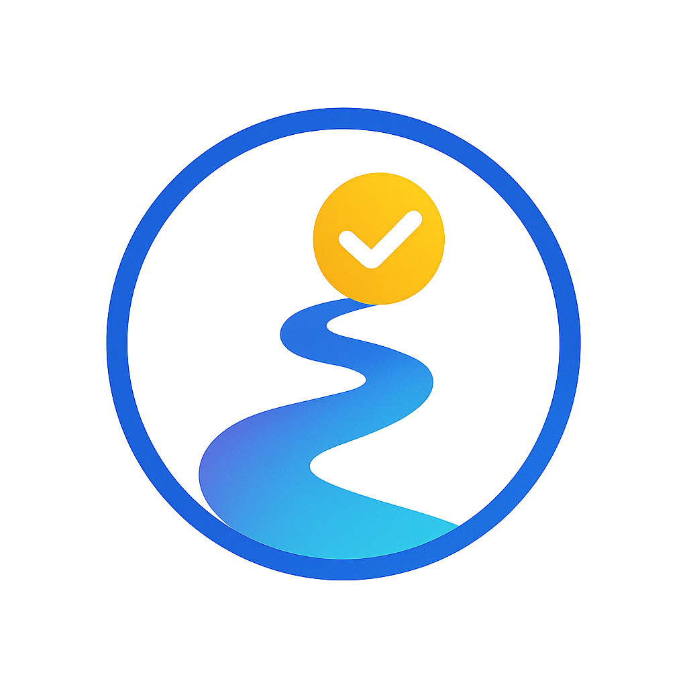

# ZenFlowIt  
### _Focus, Flow & Freedom in one place_

ZenFlowIt is an AI-powered productivity application designed to help users overcome procrastination, build momentum, and accomplish their goals without stress. The application features task management, focus tools, vision boards, and an AI assistant powered by Google's Gemini AI.




## Features

- **Smart Task Management**: Create, organize, and track tasks with AI-generated subtasks and action plans
- **Focus Tools**: Use the Pomodoro technique and other focus-enhancing tools to stay productive
- **Vision Board**: Visualize your goals with a customizable vision board
- **AI Assistant**: Get productivity advice from the ZenCoach AI Assistant
- **User Authentication**: Secure user accounts with personal workspaces
- **Rewards**: The users are rewarded with badges on successful completion of the respective tasks.

### Detailed Features

#### Task Management
- Create lists to organize your tasks by category
- Add tasks with deadlines, reminders, and repeat options
- Generate subtasks automatically using AI
- Create detailed action plans for complex tasks
- Track task completion and progress

#### Focus Tools
- Pomodoro Timer with customizable work and break durations
- Focus statistics tracking
- Visualize your focus progress with interactive gauges
- Focus music integration

#### Vision Board
- Customize your vision board with different themes and layouts
- Add visual goals with images and affirmations
- Organize goals by life categories
- Upload custom background images
- Choose different frame styles (Square, Frame, Circle)
- Color themes for each category (Light Blue, Light Green, Purple, Pink, Yellow, Orange, Red)

#### AI Assistant (ZenCoach)
- Get personalized productivity advice
- Ask questions about time management and focus techniques
- Receive tips on overcoming procrastination
- Learn how to set effective goals
- Get help with work-life balance

## Landing Page
- Our Product's initial Landing page: https://procrastination-check-qj1vw7n.gamma.site/
- Current Landing page: Updated to the website

## Installation

1. Clone this repository
2. Create a virtual environment:
   ```
   python -m venv venv
   source venv/bin/activate  
   # On Windows: venv\Scripts\activate
   ```
3. Install the required packages:
   ```
   #
   pip install -r requirements.txt
   
   ```
4. If a `.env` file is not present in the root directory, create one with the following content:
   ```
   GEMINI_API_KEY=your_gemini_api_key
   ```
   Replace `your_gemini_api_key` with your Google Gemini API key.

## Running the Application

1. Make sure your virtual environment is activated
2. Start the Streamlit server:
   ```
   streamlit run app.py
   ```
3. Open your browser and navigate to http://localhost:8501


## Directory Structure

```
├── app.py                 # Main application entry point
├── models/                # Database models - features
├── static/                # Static assets (images, etc.)
├── utils/                 # Utility functions
│   ├── ai.py              # AI integration with Gemini
│   ├── auth.py            # Authentication utilities
│   └── db.py              # Database utilities
│   └── email_service.py   # Email services utilities
│   └── theme.py           # Theme utilities
│   └── verify_env.py      # Verify utilities
├── views/                 # UI view components
│   ├── assistant.py       # AI assistant view
│   ├── auth.py            # Authentication view
│   ├── dashboard.py       # Dashboard view
│   ├── focus.py           # Focus tools view
│   ├── landing.py         # Landing page view
│   ├── tasks.py           # Task management view
│   └── vision_board.py    # Vision board view
│   └── rewards.py         # Rewards view
```

## Database

- Initial stage: The application used SQLite for data storage with the database file `productivity_app.db` created in the root directory.
- Final stage: The database was migrated to PostgreSQL and hosted on Amazon RDS (Aurora) for improved scalability and performance.

## License

This project is open source and available under the MIT License.

## Contact

For any questions or support, please open an issue in the GitHub repository.
